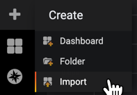
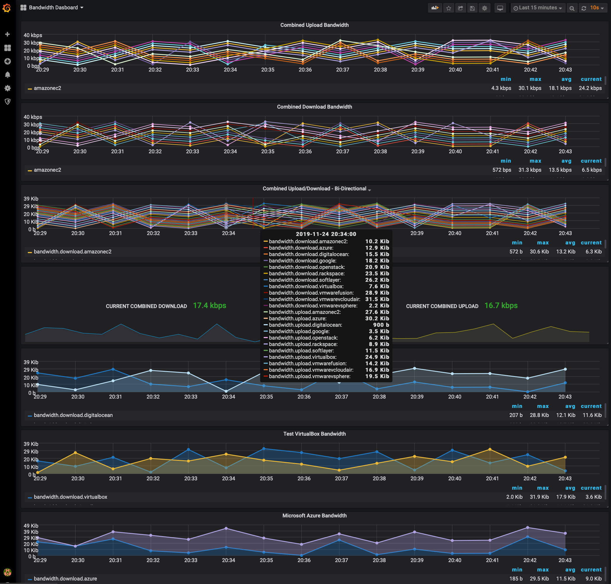
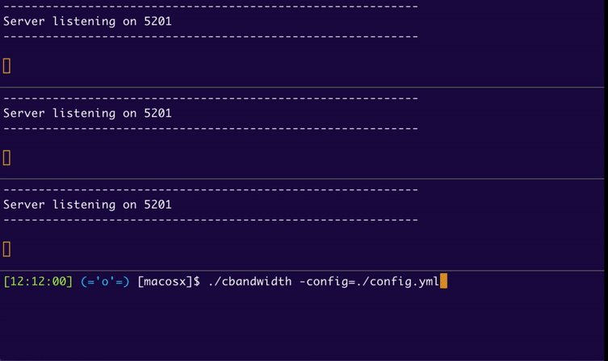

# Bandwidth Performance Monitoring

[](https://github.com/nerdalert/cloud-bandwidth/actions/workflows/build-image.yml)

### Overview

Network visibility is one of the most important assets in a network engineer's toolkit. This is a tool measuring bandwidth 
that can be useful for capacity planning, SLAs, troubleshooting or any other scenario that having a realtime and historical 
measurements of bandwidth is useful. Multiple cloud environments, coupled with data gravity driving clusters of compute at 
the edge is increasing the network sprawl and piling on the ever-growing challenges for network ops/architecture/engineering.

This project is designed to measure bandwidth to distributed endpoints across networks and clouds. Having visibility to 
edge and multi-cloud resources can get overly complicated and/or expensive with many solutions. Heavyweight agents can be 
problematic.

This is a simple method of:
- Setting up iperf servers on your edge/clouds/enterprise as listeners
- Polling the listeners
- Graphing the results into a TSDB 
- Visualizing the results into dashboards with Grafana
- Netperf/Netserver support is optional instead of Iperf3

For Kubernetes support, see [README-KUBERNETES](kubernetes/README-KUBERNETES.md) for experimental usage.

### New Opportunities to Manage Networks

- Building tools has never been easier. Open source software can be leveraged to customize tools for your network or customers network 

- Historical records of network data. Many of the traditional problems with networking and uptime can be significantly reduced
with post-mortem reviews with relevant data to determine root causes of events. 

- Rather than using traditional RDBMS approaches, here we are using Time Series Databases (TSDB) that are designed to ingest 
large amounts of timestamped metrics. That is perfect for collecting all the different metrics we are interested in as network nerds.

### QuickStart Demo

Start the TSDB and Grafana in your preferred container runtime, below is a nice and simple grafan/graphite stack (you can also setup 
your own TSDB stack as long as it supports the formatting exported shown below):

```sh
docker run -d \
   --name graphite-grafana \
   --restart=always \
   -p 80:80 \
   -p 2003-2004:2003-2004 \
   quay.io/networkstatic/graphite-grafana
 
 # or using Podman
 sudo sysctl net.ipv4.ip_unprivileged_port_start=80
 podman run -d \
    --name graphite-grafana \
    --restart=always \
    -p 80:80 \
    -p 2003-2004:2003-2004 \
   quay.io/networkstatic/graphite-grafana
```

This maps the following ports:

Host | Container | Service
---- | --------- | -------------------------------------------------------------------------------------------------------------------
  80 |        80 | [grafana](http://docs.grafana.org/)
2003 |      2003 | [carbon receiver - plaintext](http://graphite.readthedocs.io/en/latest/feeding-carbon.html#the-plaintext-protocol)
2004 |      2004 | [carbon receiver - pickle](http://graphite.readthedocs.io/en/latest/feeding-carbon.html#the-pickle-protocol)

verify you can reach the grafana/graphite server running by pointing your browser to the container IP. If you're running Docker for 
desktop on a Mac, [http://localhost](http://localhost). On a Linux host (easiest) just point to the host IP since the port is getting mapped with `-p 80:80`. 
The default login is `username: admin` and `password: admin`

```sh
git clone https://github.com/nerdalert/cloud-bandwidth.git
cd cloud-bandwidth/
```

Now you can run a simple script that will generate some metrics to simulate iperf polls and push them to the graphite/grafana server. 
I recommend starting here in order to make sure your stack is working properly.

```sh
./scripts/generate_test_grafana_data.sh <insert_ip_address of the server> 2003
```

While some generic data is getting populated, next log into the Grafana server and import a dashboard that will match the sample data the script is pushing.

- Copy the json in [default-grafana.json](./default-grafana.json) and paste it into a new dashboard by clicking the + and then import in the Grafana splash page:



- After a couple of minutes you should start seeing data getting populated like so: 



If you do not see data appearing in the graphs, it will possibly be a connectivity issue. Testing the port is a good first step with something like netcat or your favorite tool:

```sh
nc -zv <address_of_graphite/grafana container> 2003
found 0 associations
found 1 connections:
     1:	flags=82<CONNECTED,PREFERRED>
	outif lo0
	src ::1 port 49493
	dst ::1 port 2003
	rank info not available
	TCP aux info available

Connection to localhost port 2003 [tcp/*] succeeded!
```

You can also send any data you want to the Graphite/Grafana/Carbon stack for testing with:

```sh
echo "bandwidth.download.azure $RANDOM `date +%s`" | nc <insert_ip_of_the_graphite_server_here> 2003
```

It may be helpful in getting started with Grafana to use the template included here with names of the server endpoints you 
setup, or start from scratch with your endpoints. The name of the endpoint being polled is what will show up in Grafana that 
you then make a graph for. You can view all endpoints in the time-series database by entering `bandwidth.download.*` 
or `bandwidth.upload.*` from within the Grafana UI. It's pretty easy to get the hang of by playing around with the demo data 
and grafana template included that you can import.

## Quickstart with Real Bandwidth

Once you have some test data being feed into the carbon receiver, next let's measure some real bandwidth. First, if you haven't 
used iperf before, I recommend running it manually to get a feel of what's going on under the hood to get the measurements 
[nerdalert/iperf3](https://github.com/nerdalert/iperf3). The remote nodes can be simple hardware/VMs/Rasberry Pi's or even network 
devices that are flexible enough to install software on them with a little CPU allocated.

```sh
git clone https://github.com/nerdalert/cloud-bandwidth.git
cd cloud-bandwidth/
```

On your edge devices that you are measuring bandwidth to, start the iperf servers. You can either run them in a container 
or in the default namespace outside a container:

- In a container run:

```sh
# running the container in daemon mode with `-d` is the best idea but for 
# getting started to view the output for debugging the setup with stdout, I recommend:
docker run -it --restart=always --name=iperf-svr networkstatic/iperf3 -s
# or with podman 
podman run -it --restart=always --name=iperf-svr networkstatic/iperf3 -s
```
As you go beyond testing on your localhost, you will also likely want to map the iperf listening port 5201 to be exposed 
for remote connections like so using the flag `-p 5201:5201`:

```sh
docker run -it --restart=always --name=iperf3-server2 -p 5201:5201  networkstatic/iperf3 -s

# Or using podman and quay if you prefer:
podman run -it --restart=always --name=iperf3-server2 -p 5201:5201  quay.io/networkstatic/iperf3 -s
```

Just as valid, if you dont feel like using a container, you can simply install iperf3 and run it in the default namespace:

```sh
iperf3 -s
```

At any time you can delete the container with:

```sh
docker stop iperf-svr && docker rm iperf-svr
```

### COnfiguration File config.yaml

The program can be configured in three different ways, configuration file `config.yaml`, CLI arguments or ENV variables. 
Run the binary with `--help` to view the CLI/ENV configuration options. To start with, I would probably recommend the 
configuration file as discussed next.

- For testing this out, I recommend starting some iperf instances in containers on your dev machine to make troubleshooting 
- easier. The poller is a container so there is no need to map ports if you are running your test iperf server on the same 
machine as where you are running the `cloud-bandwidth` binary. 

- The `iperf-servers` in the config are the addresses of the `iperf -s` instances you are going to poll. The name after the 
address is not required, but only there for better labeling of the data e.g. `172.17.0.6: ibm-cloud`.

- `tsdb-download-prefix` and `tsdb-upload-prefix` are essentially the paths that the data is getting mapped to in the tsdb. 
Giving them meaningful names can be useful for organizing data viewing in grafana.

- `test-interval` is the time between polls to all  the nodes listed under `iperf-servers`.

- `test-length` is the time the `iperf -c` client poll will run. The longer the test the more accurate the results up to 
a certain point, but it also consumes more bandwidth so it is left to a short period in the example.

```yaml
---
# the length of the iperf test in seconds
test-length: 5
# the time between polls, defaults to 5 minutes (300 sec)
test-interval: 300
# iperf server port
server-port: 5201
# Address of the graphite/grafana stack running in a container (docker for mac uses localhost).
# For a setup beyond a dev environment, grafana-address will be a routable/reachable address
# that the polling host can connect to in order to run the client/server test.
grafana-address: localhost
grafana-port: 2003
# The prefix of the stored tsdb data in graphite
tsdb-download-prefix: bandwidth.download
tsdb-upload-prefix: bandwidth.upload
iperf-servers: 
  - 172.17.0.3: azure
  - 172.17.0.4: digitalocean
  - 172.17.0.5: colo_datacenter_xyz
# iperf-servers are the remote iperf servers getting polled
# the key is the address getting polled
# The value (after the colon )is the name that will show up in grafana 
```

The above example [config.yaml](config.yaml) file is included. The `iperf-servers:` in the config can also be DNS entries 
if using `-nocontainer` (name resolution not supported in the containers, happy to add the support if anyone wants it). 
The `config.yaml` file either needs to be in the same directory as the binary or referenced with the flag `-config=path/config.yaml`.

If you prefer the CLI for configuration, here is an example doing so. **Note:** if there is a configuration file in the same directory,
the app will merge the `iperf-servers` endpoints between the CLI/ENVs and `config.yaml`, the rest of the configuration will default to the
configuration file and then to the CLI and CLI defaults:

**Note** -perf-servers is a pair `ip:name` (the name is for more meaningful descriptions
in grafana/tsdb and mapping IPs to grafana with dots can make the prefix wonky). Multiple entries
need to be seperated by a colon ',' as exemplified below. DNS names instead of IP are
also perfectly valid to use as well. Alternatively, the name value `ip:name` you supply could
be the source node running the test. In some scenarios you could have a bunch of endpoints
testing to a single node you would want to record them to grafana as the source.
Regardless, the name should be something meaningful to the data visualization in Grafana and
doesn't need to be the name of the host you are testing to.

```shell
cloud-bandwidth \
  -perf-servers 172.17.0.3:azure,172.17.0.4:digitalocean,172.17.0.5 \
   -test-length 3 -test-interval 30 \
   -grafana-address 192.168.1.100 \
   -grafana-port 2003 \
   -nocontainer \
   -debug
```

### Start polling

- Now start the poller by dropping into the binaries directory and running the binary if on Linux. See the build section for compiling for other machine archs.

- Docker or Podman are supported, but not required as long as iperf3 is installed you can pass the `-nocontainer` flag. 

- The app provides a sample of the bi-drectional bandwidth by testing both upload and download speeds between the server and poller.

Linux:

```sh
cd ./binaries/linux/
./cloud-bandwidth -config=config.yaml -debug
```

The output will look something like this using the default `config.yaml` (if you started some iperf3 instances to test to):

```shell
./cloud-bandwidth -config=config.yml
INFO[0005] Download results for endpoint 172.17.0.3 [azure] -> 5020388 bps
INFO[0010] Upload results for endpoint 172.17.0.3 [azure] -> 4643267 bps
INFO[0016] Download results for endpoint 172.17.0.4 [digitalocean] -> 4353795 bps
INFO[0021] Upload results for endpoint 172.17.0.4 [digitalocean] -> 4619377 bps
INFO[0026] Download results for endpoint 172.17.0.2 [colo_datacenter_xyz] -> 4737081 bps
INFO[0032] Upload results for endpoint 172.17.0.2 [colo_datacenter_xyz] -> 4649928 bps
```

To view the underlying commands being run such as the iperf polling and the writes to Carbon, simply add the `./cloud-bandwidth -debug` flag.

Here is some example output of the app polling three endpoints:



### Run without containers

- If you don't want to use containers at all, simply pass `-nocontainer`

```shell
./cloud-bandwidth -config=config.yml -nocontainer -debug
INFO[0000] Running shell command ->  [-c iperf3 -P 1 -t 5 -f K -p 5201 -c 172.17.0.3 | tail -n 3 | head -n1 | awk '{print $7}']
```
### Building the Binary

You can also of course run this using `go run cloud-bandwidth.go` directly. 

You can also build binaries for your machine type. For other hardware architectures you can cross-compile in go. 
Supported types can be seen with `go tool dist list` and is as simple as the following example 
`GOOS=linux GOARCH=amd64 go build -o cloud-bandwidth -v cbandwidth.go` which will leave a binary in the working 
directory named `cloud-bandwidth`.

- Build it yourself with [go](https://go.dev/doc/install):

```shell
git clone https://github.com/nerdalert/cloud-bandwidth.git
cd cloud-bandwidth
go build
./cloud-bandwidth -h
```

### Custom Iperf3 image repo

You can also use your own iperf3 image with `-image`
```shell
./cloud-bandwidth -config=config.yml -image quay.io/networkstatic/iperf3 -debug
INFO[0000] Running shell command ->  [-c docker run -i --rm quay.io/networkstatic/iperf3 -P 1 -t 5 -f K -p 5201 -c 172.17.0.3 | tail -n 3 | head -n1 | awk '{print $7}']
```

### Netperf and Netserver

Netperf/Netserver is an alternative bandwidth measuring tool. While the CLI output has always been
a little rough, it has interesting capabilities that Iperf does not. Specifically, netperf can measure 
CPU usage on the client and server side as well as run tests from multiple clients
concurrently. Iperf servers block any new tests if a test is in progress, while netserver/netperf will
allow for the tests to run concurrently. This is especially attractive when looking to measure aggregate 
bandwidth through gateways/aggregation points.

Here are the basics of the command:

- Server side

```shell
docker run  -it --rm --name=netserver -p 12865:12865 quay.io/networkstatic/netserver -D
```

- Client side
```shell
# Grab the IP address of the netserver started above
docker inspect --format "{{ .NetworkSettings.IPAddress }}" netserver
172.17.0.5

# Run a test against the netserver address
docker run  -it --rm quay.io/networkstatic/netperf -l 5 -H 172.17.0.5

latest: Pulling from networkstatic/netperf
Digest: sha256:1bbcae9884ad9397b190e5a9d818efe7266c18cdcbb0abc44ba5086f062b4519
Status: Image is up to date for quay.io/networkstatic/netperf:latest
MIGRATED TCP STREAM TEST from 0.0.0.0 (0.0.0.0) port 0 AF_INET to 172.17.0.5 () port 0 AF_INET : demo
enable_enobufs failed: getprotobyname
Recv   Send    Send
Socket Socket  Message  Elapsed
Size   Size    Size     Time     Throughput
bytes  bytes   bytes    secs.    10^6bits/sec

131072  16384  16384    10.00    11299.58
```

More details on the container usage can be viewed at [nerdalert/netperf-netserver](https://github.com/nerdalert/netperf-netserver).

To run this with cloud-bandwidth, the following is an example (Netserver IP is `172.17.0.5` and the grafana display name would be `netserver-host`):

```shell
./cloud-bandwidth -perf-servers 172.17.0.5:netserver-host \
    -test-length 3 \
    -test-interval 30 \
    -grafana-address x.x.x.x \
    -grafana-port 2003 \
    -netperf \
    -debug 
```

### Feedback!


Thats it! Patch, Fork, do whatever you want with it. Thanks to all the various open source projects used for this. 
Kudos to [ESnet](http://software.es.net/iperf/) for re-rolling iperf into iperf3. It is really nice how the initialized 
channel from client -> server is reused for the reverse. It gives you bi-directional measurements without having to expose 
(or NAT) both endpoints, just the channel initializer. Feel free to open any issues if you run into anything. I will improve 
things as time permits. Thanks!
