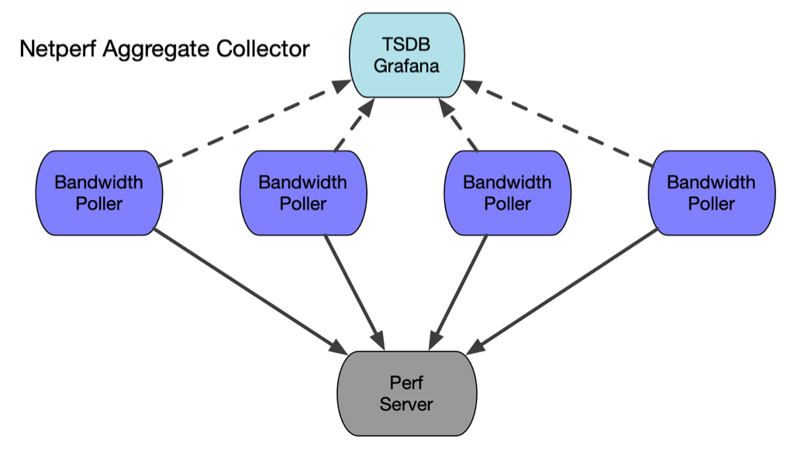
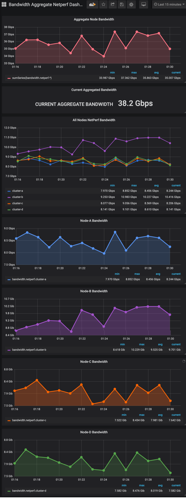
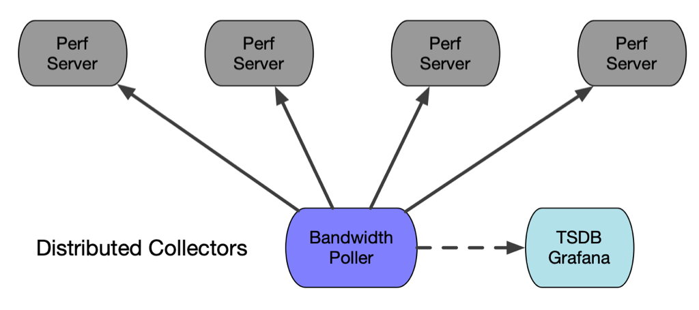

### [WIP] Kubernetes Deployment

In a Kubernetes environment, one can leverage the K8s control plane to setup
collectors and pollers to simplify deployment and managing the lifecycle. For the
most part, daaemonsets are an attractive route to deploy pollers and listeners since
the pods get deployed on all nodes by default. 

### Scenario 1 - Aggregate Collector and Distributed Pollers

There are some drawbacks with daemonsets, particularly with regard to Iperf since it is not capable of running concurrent tests, only one
at a time. Daemonsets will deploy the same workload at once so that means all pods
would try and initiate a bandwidth test at once and only one node would get through while
the rest would receive busy signals. This can be juggled but it requires much more control
plane interaction to ensure there is a lock only one client running at a time.

Netperf becomes very attractive for this aggregate scenario where we want to collect 
measurements at potential choke points, such as gateways and proxies. Netperf supports 
concurrent bandwidth tests and will multi-thread the multiple streams. Netperf is also very
useful for capturing the CPU load associated with the network i/o.

- As shown in the diagram, multiple pollers will connect to the single netperf instance
and measure the bandwdith to that node. Since it is a daemonset, all nodes will run the
test concurrently so you will get an aggregate reading in the data visualized in grafana.

<p align="center">

</p>

To deploy this scenario, simply start a netperf server where you want the aggregate data to
funnel into and spin up a tsdb/grafana instance.

- Start the Netserver collector (netserver is the server side and netperf is the client side)

```shell
$ docker run  -itd --rm --name=netserver -p 12865:12865 networkstatic/netserver -D
# or use podman and/or quay.io
$ podman run  -itd --rm --name=netserver -p 12865:12865 quay.io/networkstatic/netserver -D
# or outside of a container with
$ netserver -D
```

- Start the TSDB/Grafana instance. You can use [grafana-template-netperf-aggregate.json](grafana-template-netperf-aggregate.json)
and import it into Grafana to get started with a demo.


```sh
docker run -d \
   --name graphite-grafana \
   --restart=always \
   -p 80:80 \
   -p 2003-2004:2003-2004 \
   quay.io/networkstatic/graphite-grafana
 
 # or using Podman
 sudo sysctl net.ipv4.ip_unprivileged_port_start=80
 podman run -d \
    --name graphite-grafana \
    --restart=always \
    -p 80:80 \
    -p 2003-2004:2003-2004 \
   quay.io/networkstatic/graphite-grafana
```

The default daemonset configuration is set to poll for 5 seconds every 5 minutes.
Keep in mind this will generate traffic on your network and if it was an extremely large cluster
on an already saturated network, you could create latency during that 5 second traffic burst.
TLDR; start small in a lab! 

- The ENV varriables in the daemonset configuration need to be adjusted
add in your setup, particularly plugging in your IP or DNS addresses for 
`CBANDWIDTH_PERF_SERVERS` and `CBANDWIDTH_GRAFANA_ADDRESS`. In the configuration
below, both the netserver instance and grafana instance are on `192.168.122.1`. 
That will almost certianly be different in your environment. See 
[quickstart demo](https://github.com/nerdalert/cloud-bandwidth#quickstart-demo) for
more setup information.
- Example daemonset file listed below [cloud-bandwidth-netperf-ds.yaml](cloud-bandwidth-netperf-ds.yaml)

```yaml
# kubectl delete daemonset iperf -n kube-system; kubectl apply -f iperf-ds-exit.yaml
apiVersion: apps/v1
kind: DaemonSet
metadata:
  name: cloud-bandwidth-netperf-ds
  namespace: kube-system
spec:
  selector:
    matchLabels:
      name: netperf-client
  template:
    metadata:
      labels:
        name: netperf-client
    spec:
      hostNetwork: true
      hostIPC: true
      hostPID: true
      containers:
        - name: cloud-bandwidth-netperf
          image: quay.io/networkstatic/cloud-bandwidth
          env:
            - name: CBANDWIDTH_PERF_SERVERS
              value: "192.168.122.1"
            - name: CBANDWIDTH_PERF_SERVER_PORT
              value: "2003"
            - name: CBANDWIDTH_POLL_INTERVAL
              value: "20"
            - name: CBANDWIDTH_POLL_LENGTH
              value: "3"
            - name: CBANDWIDTH_DOWNLOAD_PREFIX
              value: "bandwidth.netperf"
            - name: CBANDWIDTH_GRAFANA_ADDRESS
              value: "192.168.122.1"
            - name: CBANDWIDTH_GRAFANA_PORT
              value: "2003"
            - name: NODE_NAME
              valueFrom:
                fieldRef:
                  fieldPath: spec.nodeName
          securityContext:
            allowPrivilegeEscalation: true
            privileged: true
          command: ["/bin/sh","-c"]
          args:
          - |
            while true; do
              ./cloud-bandwidth -perf-servers $CBANDWIDTH_PERF_SERVERS:$NODE_NAME \
                -perf-server-port $CBANDWIDTH_PERF_SERVER_PORT \
                -test-interval $CBANDWIDTH_POLL_INTERVAL \
                -test-length $CBANDWIDTH_POLL_LENGTH \
                -tsdb-download-prefix $CBANDWIDTH_DOWNLOAD_PREFIX \
                -grafana-address $CBANDWIDTH_GRAFANA_ADDRESS \
                -grafana-port $CBANDWIDTH_GRAFANA_PORT \
                -netperf \
                -nocontainer \
                -debug;
            done
      terminationGracePeriodSeconds: 60
```

Once you have added your IP addresses or any other configuration parameter run the daemonset

```shell
# daemonsets are always created in the kube-system namespace
kubectl apply -f <file-containing-the-above-yaml>.yaml

# to delete the daemonset and associated pods, run:
kubectl delete daemonset cloud-bandwidth-netperf-ds -n kube-system
```

View the logs on one of the pods on any node and you should see output like this:

```shell
$ kubectl logs cloud-bandwidth-netperf-ds-2w6c9 -n kube-system
time="2022-03-15T04:04:30Z" level=info msg="no configuration file found, defaulting to command line arguments"
time="2022-03-15T04:04:30Z" level=debug msg="Configuration as follows:"
time="2022-03-15T04:04:30Z" level=debug msg="[Config] Grafana Server = 192.168.122.1:2003"
time="2022-03-15T04:04:30Z" level=debug msg="[Config] Test Interval = 300sec"
time="2022-03-15T04:04:30Z" level=debug msg="[Config] Test Length = 5sec"
time="2022-03-15T04:04:30Z" level=debug msg="[Config] TSDB download prefix = bandwidth.netperf"
time="2022-03-15T04:04:30Z" level=debug msg="[Config] TSDB upload prefix = bandwidth.upload"
time="2022-03-15T04:04:30Z" level=debug msg="[Config] Perf Server = 192.168.122.1:cluster-d"
time="2022-03-15T04:04:30Z" level=debug msg="[Config] Perf Binary = netperf"
time="2022-03-15T04:04:30Z" level=debug msg="[Config] Perf Server Port = 12865"
time="2022-03-15T04:04:30Z" level=debug msg="[CMD] Running Command -> [-c netperf -P 0 -t TCP_STREAM -f k -l 3 -p 12865 -H 192.168.122.1 | awk '{print $5}']"
time="2022-03-15T04:04:33Z" level=info msg="Download results for endpoint 192.168.122.1 [cluster-d] -> 8594749000 bps"
time="2022-03-15T04:04:33Z" level=info msg="Sending the following msg to the tsdb: bandwidth.netperf.cluster-d 8594749000 1647317073\n"
time="2022-03-15T04:04:53Z" level=debug msg="[CMD] Running Command -> [-c netperf -P 0 -t TCP_STREAM -f k -l 3 -p 12865 -H 192.168.122.1 | awk '{print $5}']"
time="2022-03-15T04:04:56Z" level=info msg="Download results for endpoint 192.168.122.1 [cluster-d] -> 8482690000 bps"
time="2022-03-15T04:04:56Z" level=info msg="Sending the following msg to the tsdb: bandwidth.netperf.cluster-d 8482690000 1647317096\n"
time="2022-03-15T04:05:16Z" level=debug msg="[CMD] Running Command -> [-c netperf -P 0 -t TCP_STREAM -f k -l 3 -p 12865 -H 192.168.122.1 | awk '{print $5}']"
time="2022-03-15T04:05:19Z" level=info msg="Download results for endpoint 192.168.122.1 [cluster-d] -> 8075824000 bps"
```
- Drill into the data as described in the quickstart for setting up how to view each node.
In the grafana template the node names are `cluster-a`, `cluster-b`, `cluster-c` etc. The output
in grafana looks like so:

<p align="center">

</p>

### Scenario 2 - Distributed Collectors

In this scenario, rather than deploying a number of pollers to all nodes in the cluster, we
deploy multiple collectors. This avoids the concurrency issue of Iperf if you only deploy one or a few
pollers and limit the odds of a test collision.

<p align="center">

</p>

- Iperf server Daemonset - Example daemonset yaml file listed below [cloud-bandwidth-iperf-server-ds.yaml](cloud-bandwidth-iperf-server-ds.yaml)

```yaml
# todo: add description
apiVersion: apps/v1
kind: DaemonSet
metadata:
  name: cloud-bandwidth-iperf-server-ds
  namespace: kube-system
spec:
  selector:
    matchLabels:
      name: iperf-server
  template:
    metadata:
      labels:
        name: iperf-server
    spec:
#      Uncomment the following fields to use host networking.
#      Host networking will keep more static addresses
#      but also takes a different network path both
#      internally to the node and externally inter-node
#      hostNetwork: true
#      hostIPC: true
#      hostPID: true
      containers:
      - name: iperf3
        image: quay.io/networkstatic/iperf3
        args: ["-s"]
        ports:
        - containerPort: 5201
      terminationGracePeriodSeconds: 60
```

- Cloud Bandwidth container poller deployment: - Example deployment yaml file listed below [cloud-bandwidth-poller-deployment.yaml](cloud-bandwidth-poller-deployment.yaml)

```yaml
apiVersion: apps/v1
kind: Deployment
metadata:
  name: cloud-bandwidth-poller
  labels:
    app: cloud-bandwidth-poller
spec:
  replicas: 1
  selector:
    matchLabels:
      app: cloud-bandwidth-poller
  template:
    metadata:
      labels:
        app: cloud-bandwidth-poller
    spec:
      containers:
        - name: cloud-bandwidth
          image: quay.io/networkstatic/cloud-bandwidth
          env:
            - name: CBANDWIDTH_PERF_SERVERS  # Fill in the servers you want to poll in CBANDWIDTH_PERF_SERVERS "IP:name" or "DNS:name"
              value: "10.42.0.12:cluster-a,10.42.1.19:cluster-b,10.42.2.3:cluster-c,10.42.3.3:cluster-d"
            - name: CBANDWIDTH_PERF_SERVER_PORT
              value: "5201"
            - name: CBANDWIDTH_POLL_INTERVAL
              value: "300"
            - name: CBANDWIDTH_POLL_LENGTH
              value: "5"
            - name: CBANDWIDTH_DOWNLOAD_PREFIX
              value: "bandwidth.download"
            - name: CBANDWIDTH_UPLOAD_PREFIX
              value: "bandwidth.upload"
            - name: CBANDWIDTH_GRAFANA_ADDRESS
              value: "192.168.122.1"
            - name: CBANDWIDTH_GRAFANA_PORT
              value: "2003"
          securityContext:
            allowPrivilegeEscalation: true
            privileged: true
          command: ["/bin/sh","-c"]
          args:
            - |
              while true; do
                ./cloud-bandwidth -perf-servers $CBANDWIDTH_PERF_SERVERS \
                  -perf-server-port $CBANDWIDTH_PERF_SERVER_PORT \
                  -test-interval $CBANDWIDTH_POLL_INTERVAL \
                  -test-length $CBANDWIDTH_POLL_LENGTH \
                  -tsdb-download-prefix $CBANDWIDTH_DOWNLOAD_PREFIX \
                  -tsdb-upload-prefix $CBANDWIDTH_UPLOAD_PREFIX \
                  -grafana-address $CBANDWIDTH_GRAFANA_ADDRESS \
                  -grafana-port $CBANDWIDTH_GRAFANA_PORT \
                  -nocontainer \
                  -debug;
              done
      terminationGracePeriodSeconds: 60
```

Now view the logs from the poller deployment, you should seem something like the following:

```shell
$ k logs cloud-bandwidth-poller-5857b44f5c-59dqn
time="2022-03-15T06:34:06Z" level=info msg="no configuration file found, defaulting to command line arguments"
time="2022-03-15T06:34:06Z" level=debug msg="Configuration as follows:"
time="2022-03-15T06:34:06Z" level=debug msg="[Config] Grafana Server = 192.168.122.1:2003"
time="2022-03-15T06:34:06Z" level=debug msg="[Config] Test Interval = 60sec"
time="2022-03-15T06:34:06Z" level=debug msg="[Config] Test Length = 4sec"
time="2022-03-15T06:34:06Z" level=debug msg="[Config] TSDB download prefix = bandwidth.download"
time="2022-03-15T06:34:06Z" level=debug msg="[Config] TSDB upload prefix = bandwidth.upload"
time="2022-03-15T06:34:06Z" level=debug msg="[Config] Perf Server = 10.42.0.12:cluster-a"
time="2022-03-15T06:34:06Z" level=debug msg="[Config] Perf Server = 10.42.1.19:cluster-b"
time="2022-03-15T06:34:06Z" level=debug msg="[Config] Perf Server = 10.42.2.3:cluster-c"
time="2022-03-15T06:34:06Z" level=debug msg="[Config] Perf Server = 10.42.3.3:cluster-d"
time="2022-03-15T06:34:06Z" level=debug msg="[Config] Perf Binary = 5201"
time="2022-03-15T06:34:06Z" level=debug msg="[Config] Perf Server Port = 5201"
time="2022-03-15T06:34:06Z" level=debug msg="[CMD] Running Command -> [-c iperf3 -P 1 -t 4 -f k -p 5201 -c 10.42.0.12 | tail -n 3 | head -n1 | awk '{print $7}']"
time="2022-03-15T06:34:10Z" level=info msg="Download results for endpoint 10.42.0.12 [cluster-a] -> 6069361000 bps"
time="2022-03-15T06:34:10Z" level=info msg="Sending the following msg to the tsdb: bandwidth.download.cluster-a 6069361000 1647326050\n"
time="2022-03-15T06:34:10Z" level=debug msg="[CMD] Running Command -> [-c iperf3 -P 1 -R -t 4 -f k -p 5201 -c 10.42.0.12 | tail -n 3 | head -n1 | awk '{print $7}']"
time="2022-03-15T06:34:14Z" level=info msg="Upload results for endpoint 10.42.0.12 [cluster-a] -> 4474268000 bps"
time="2022-03-15T06:34:14Z" level=info msg="Sending the following msg to the tsdb: bandwidth.upload.cluster-a 4474268000 1647326054\n"
time="2022-03-15T06:34:14Z" level=debug msg="[CMD] Running Command -> [-c iperf3 -P 1 -t 4 -f k -p 5201 -c 10.42.1.19 | tail -n 3 | head -n1 | awk '{print $7}']"
time="2022-03-15T06:34:18Z" level=info msg="Download results for endpoint 10.42.1.19 [cluster-b] -> 61998884000 bps"
time="2022-03-15T06:34:18Z" level=info msg="Sending the following msg to the tsdb: bandwidth.download.cluster-b 61998884000 1647326058\n"
time="2022-03-15T06:34:18Z" level=debug msg="[CMD] Running Command -> [-c iperf3 -P 1 -R -t 4 -f k -p 5201 -c 10.42.1.19 | tail -n 3 | head -n1 | awk '{print $7}']"
time="2022-03-15T06:34:22Z" level=info msg="Upload results for endpoint 10.42.1.19 [cluster-b] -> 53034188000 bps"
time="2022-03-15T06:34:22Z" level=info msg="Sending the following msg to the tsdb: bandwidth.upload.cluster-b 53034188000 1647326062\n"
time="2022-03-15T06:34:22Z" level=debug msg="[CMD] Running Command -> [-c iperf3 -P 1 -t 4 -f k -p 5201 -c 10.42.2.3 | tail -n 3 | head -n1 | awk '{print $7}']"
time="2022-03-15T06:34:26Z" level=info msg="Download results for endpoint 10.42.2.3 [cluster-c] -> 7426153000 bps"
time="2022-03-15T06:34:26Z" level=info msg="Sending the following msg to the tsdb: bandwidth.download.cluster-c 7426153000 1647326066\n"
time="2022-03-15T06:34:26Z" level=debug msg="[CMD] Running Command -> [-c iperf3 -P 1 -R -t 4 -f k -p 5201 -c 10.42.2.3 | tail -n 3 | head -n1 | awk '{print $7}']"
time="2022-03-15T06:34:30Z" level=info msg="Upload results for endpoint 10.42.2.3 [cluster-c] -> 7214681000 bps"
time="2022-03-15T06:34:30Z" level=info msg="Sending the following msg to the tsdb: bandwidth.upload.cluster-c 7214681000 1647326070\n"
time="2022-03-15T06:34:30Z" level=debug msg="[CMD] Running Command -> [-c iperf3 -P 1 -t 4 -f k -p 5201 -c 10.42.3.3 | tail -n 3 | head -n1 | awk '{print $7}']"
time="2022-03-15T06:34:34Z" level=info msg="Download results for endpoint 10.42.3.3 [cluster-d] -> 3853351000 bps"
```

WIP - to be continued...
